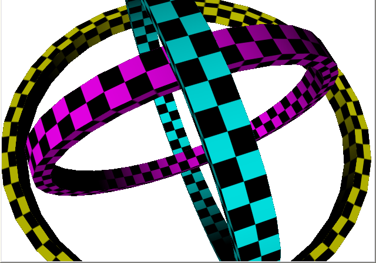

# Rings3D
This is Simple C++ DirectX 8 demo written by myself in far far away 2005 year.
Just have only one source file, nothing else.

# Keyboard controls:

* F8 : Pause - Continue play;
* F9 : Toggle bright/dark background;
* F1-F4 : Change to None, Point, Linear or Anisotropic texture filtration mode;
* F5-F7 : Toggle vertices/wireframe/solid faces;
* F11 : Toggle alpha blending;
* Enter : Change fullscreen/windowed.

# To build:
1. Create an empty project in Visual Studio C++ 
2. Append main.cpp to that project as main cpp file
3. Compile and build one

or

1-3. Browse himself to 'Release' folder and run already been built .EXE.

4. Enjoy.

# Author
An0ther0ne